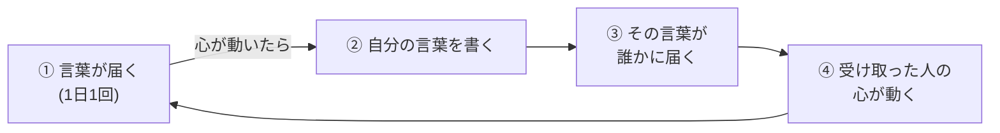
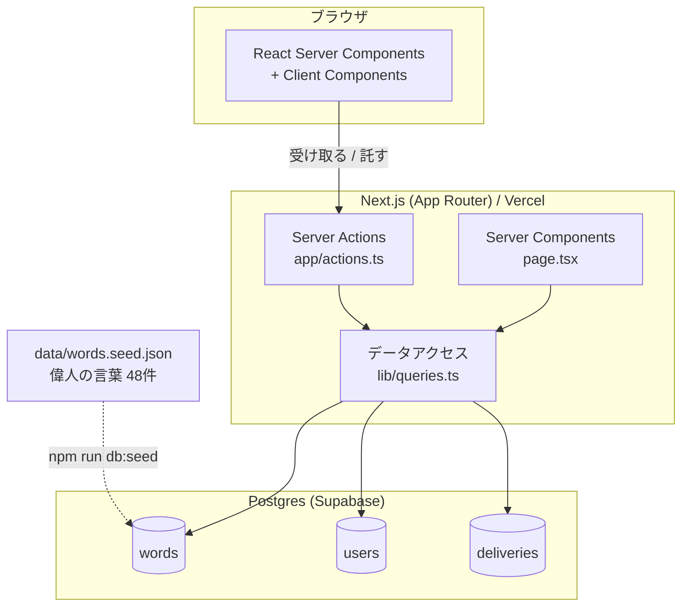
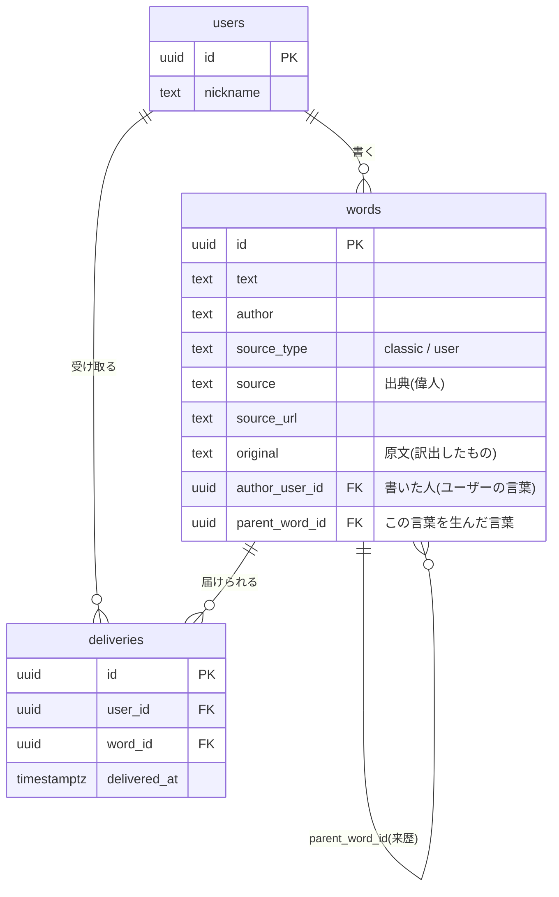

# ことづて

> ことづて:人から人へ託されて運ばれる言葉

**ひとつの言葉が、別の誰かの言葉を生んでいく場所。**

偉人の言葉を種火に、心が動いた人が自分の言葉を書く。その言葉は明日、別の誰かに届く。
最初は偉人しかいない。でも使われるほど、ユーザー自身が誰かにとっての思想家になる。


上の30秒で起きていること — 言葉がひとつ届く → **芥川龍之介 → はるか → けんた → みお**と4世代の来歴をたどる →
自分の言葉を書いて託す → 誰かが受け取る → **他人の軌跡に「この言葉から、ことづてが生まれました」と現れる**。

---

## このサービスが集めるもの

**名言ではありません。「言葉と、それによって動いた自分」です。**

|  | 名言アプリ | SNS | 日記アプリ | ことづて |
|---|---|---|---|---|
| 集めるもの | 偉人の言葉 | 投稿・反応 | 出来事・感情 | **言葉 + それで自分がどう動いたか** |
| 誰が読まれるか | 偉人のみ | 目立つ人 | 本人のみ | **誰でも** |
| 言葉の行き先 | お気に入り一覧 | 流れて消える | 非公開の記録 | **次の誰かに届く** |

---

## 課題

自分の「当たり前」は、自分では見られない。見えるのは、違う考えに触れたときだけ。

このプロダクトは、母親と「掃除」で衝突した実体験から出発している。整理すると、それは掃除の問題ではなく、
「家 = 回復空間」という自分の前提と「家 = 共同生活の基盤」という母親の前提がズレていただけだった。
価値があったのは母親を理解したこと以上に、**自分の前提が初めて目に見える形になったこと**であり、
その気づきは一人の内省からではなく、異なる考えを持つ他者に触れたから生まれた。

### 誰のためのサービスか

**自分の中で考えすぎる人。人に気を使いすぎて、言いたいことを飲み込む人。**

そういう人に必要なのは、自分に宛てられた返信ではない。宛てられた言葉には防御が立つし、
名前を出して表明した意見は引っ込めにくい。必要なのは、
**自分と関係のないところで生きている、他人の世界にふれること**である。

このサービスでは、誰もあなたに宛てて書けない。いいねも返信も存在しない。
だから、人に気を使いすぎる人にとって**唯一、安心して開ける場所**になる。
これは機能の不足ではなく、このプロダクトが提供する価値そのものである。

---

## 中核:影響の循環

このプロダクトの本質は個別機能ではなく、ひとつの循環である。



**「本を作るアプリ」ではなく「影響が循環する場所」である。**
蓄積(軌跡)は循環の結果として生まれるものであり、目的ではない。

### 受け渡されているのは、考えではない

系譜をたどると、内容が受け継がれていないことがわかる。

| | 何について書いているか |
|---|---|
| 芥川龍之介 | 危険思想と常識の関係 |
| はるか | 自分が黙ってきたのは、常識のためではなく波風を避けたかっただけ |
| けんた | 会議で黙ることは、賛成したことになっていた |
| みお | 友達の悪口に黙っていた自分 |

芥川の主題は「危険思想」、みおの主題は「友達の悪口」で、共通する内容はない。
残っているのは **「この言葉がなければ、この言葉は生まれなかった」という関係だけ**である。

これは偶然ではない。書く内容を感想ではなく「**自分がどう動いたか**」に限定した時点で、
内容は必ず書き手の側に寄る。内容が変質するのは設計の帰結であって、事故ではない。

だからこのプロダクトが扱っているのは思想の伝播ではなく、**影響の循環**である。
リツイートは内容が変わらずに広がるが、ここでは**内容が変わらないと成立しない。**
転送ボタンを置いていないのではなく、転送が原理的に不可能な構造になっている。

### 循環が画面の中で閉じていること

抽選プールにユーザーの言葉を入れるだけでは、循環はピッチの中にしか存在しない。
そこで2つを実装している。

**受け取る側**には、その言葉が何から生まれたかを添えて表示する。

```
「黙るのは中立じゃない、という一文で、先月の自分を思い出した。……」
                                                        — みお

この言葉は、みおさんがけんたさんの言葉に触れて書いたものです
  │ 波風を立てたくない、が自分にもある。会議で違和感を持っても……

芥川龍之介 → はるか → けんた → みお
```

**書いた側**には、それが誰かに渡ったことを見せる。

```
あなたの言葉を、今日 4 人が受け取りました
```

そして、自分の言葉を親にして誰かが書いたとき、**わたしの軌跡にその言葉が現れる**。

```
この言葉から、ことづてが生まれました
  │ 波風を立てたくない、が自分にもある。会議で違和感を…… — けんたさん
```

「受け取りました」は到達量だが、こちらは**変化の証拠そのもの**である。
返信ではない——書いた人はこちらに宛てておらず、こちらから返す手段もない。
ただ「自分の言葉が誰かの前提を動かした」という事実だけが返ってくる。
**「思想家とは誰かの考えを変えた人」という定義を、ユーザーが満たした瞬間がここに見える。**

溜まることではなく、渡ることが嬉しい設計にしている。

---

## 画面

| | 画面 | 内容 |
|---|---|---|
| ホーム | `/` | 今日のことづて(来歴つき)・書く・「あなたの言葉を◯人が受け取りました」 |
| 2番目 |  `/trace` | わたしの軌跡(届いた言葉と、それに対して書いた言葉) |
| 3番目 | `/others` | 他の人の軌跡を読む |
| デモ用 | `/demo` | 別の人として開く・その場で1周させる(`ALLOW_REROLL=true` のときだけ) |

---

## アーキテクチャ



APIサーバーを別に立てず、Server Components と Server Actions でフロントとバックエンドを1プロジェクトに収めている。
ブラウザからDBへの直接アクセスはなく、SQL はすべてサーバー側にある。
本編のクエリは読み書きとも [`lib/queries.ts`](lib/queries.ts) に集約し、Server Actions からは名前のついた関数として呼ぶ
(デモ用画面 `app/demo/` だけは、そこでしか使わないクエリを同居させている)。

### データ構造



**この構造が実現していること**

1. **偉人とユーザーが同じテーブルに同じ形式で並ぶ**(`words`)。
   「思想家とは有名人ではなく、誰かの考えを変えた人である」という思想が、データ構造そのものに埋め込まれている。
   抽選も1つのテーブルを引くだけで済み、比率は `CLASSIC_RATIO` で制御する。

2. **`parent_word_id` が影響の来歴を保持する。**
   これは血統や継承ではなく、「**この言葉がなければ、この言葉は生まれなかった**」を記録している。
   ニーチェ → Aさん → Bさん → あなた、という連鎖を再帰クエリ1回でたどれる([`getWordWithLineage`](lib/queries.ts))。

3. **`deliveries` が3つの役割を同時に果たす。**
   - `unique (user_id, word_id)` で同じ言葉を同じ人に重複配信しない
   - 「あなたの言葉を◯人が受け取りました」を数える
   - 循環が実際に回っている証跡になる

「軌跡の1点」は独立したテーブルを持たない。**点 = 自分が書いた言葉 + その `parent_word_id`** で
完全に表せるため、テーブルを増やさずに `words` から導出している。

---

## 収録した言葉について

**偉人の言葉48件は、すべてパブリックドメインの原典から手作業で採取している。生成AIに名言を作らせたものは一件も含まれていない。**

「偉人の名言」は、インターネット上で誤帰属・捏造が最も蔓延しているジャンルである。
出典を追えない引用を混ぜた時点で、プロダクト全体の信頼性が損なわれる。そのため、

1. 原典の本文を実際に取得する
2. 出典URL(`source_url`)をデータに保持する — 全48件
3. 原典から訳出・現代語化したものは原文(`original`)を併記する — 27件

の3点により、すべての言葉を検証可能な状態に保っている。
収録元は青空文庫・Project Gutenberg・中文Wikisource。原著者と翻訳者の双方について保護期間満了を確認済み。

漢文・英文・文語のように**言語や時代が読解の壁になるものは現代日本語に訳している**。
訳出にはAIの支援を受けているが、**原文を必ず併記しているため照合できる**。
「存在しない引用を作らせる」ことと「実在する原文を移す」ことは別のもので、前者は一切行っていない。
なお**アプリの実行時にAIは呼び出していない** — 配信も抽選も来歴の表示も、すべてSQLだけで動いている。

詳細は [docs/sources.md](docs/sources.md)。

---

## 工夫した点

1. **機能の集合ではなく、ひとつの循環として設計した。**
   受け取る・書く・届く・また誰かが受け取る、が1本の輪になっている。

2. **報酬を「溜まること」ではなく「渡ること」に置いた。**
   抽選プールに入れるだけでは循環はピッチの中にしか存在しない。「届いた」を可視化して初めてユーザーが輪を体験できる、という設計判断。

3. **あえて解釈させない。**
   「あなたはこういう人です」と分析する実装のほうが簡単だが、それをやらない。気づきの所有権をユーザーに残すため、AIによる前提の抽出は入れていない。

4. **偉人とユーザーを同じテーブルに置いた。**
   データ構造そのものが「誰もが思想家になりうる」という思想を表現している。

5. **議論の構造を持ち込まなかった。**
   コメントも返信もいいねもない。SNS的な対立と承認から意図的に距離を置いた。

6. **引用の正しさをデータ構造で担保した。**
   `source_url` と `original` を必須の設計要素として持ち、誤帰属が混入しない状態にした。

7. **循環が見える状態をデモ用データとして再現可能にした。**
   機能が正しく動いていても、データがなければ来歴も到達件数も画面に出ない。
   [`scripts/demo.ts`](scripts/demo.ts) が4世代の系譜と配信履歴を投入し、`/demo` から循環をその場で1周させられる。

8. **最初の1語と、言葉の巡りを運任せにしない。**
   初めて受け取る言葉は来歴のあるものを優先する。比率が偉人7:ユーザー3である以上、
   初対面の7割は来歴なしになり、このプロダクトの新規性が最初の1語で見えないままになるため。
   また抽選は配信回数の少ない言葉を優先し(同数の中では無作為)、
   プールが増えても**すべての言葉がいつか誰かに届く**ことを保証している。

---

## 技術スタック

| 領域 | 選択 | 理由 |
|---|---|---|
| フレームワーク | Next.js 16 (App Router) | Server Components / Server Actions でフロントとバックを1プロジェクトに収める |
| 言語 | TypeScript | |
| スタイリング | Tailwind CSS v4 | 短時間で見た目を整えられる |
| データ保存 | Postgres (Supabase) | 他の人の軌跡を読むために共有が必要。ローカル開発は素の Postgres で同じスキーマが動く |
| DBアクセス | postgres.js | ORM を挟まず、SQL をそのまま読める形で残す |
| デプロイ | Vercel | |

AI は使っていない。「システムが解釈しない」という方針と、AIに前提を言語化させる設計が矛盾するため。

---

## セットアップ

### 1. 依存をインストール

```bash
npm install
```

### 2. データベースを用意する

**Supabase を使う場合**

1. [supabase.com](https://supabase.com) でプロジェクトを作る
2. Project Settings → Database → Connection string から接続文字列を取得する
   - Vercel から使う場合は Session pooler(5432番)か Transaction pooler(6543番)を選ぶ

**ローカルの Postgres を使う場合**

```bash
createdb kotozute
```

### 3. 環境変数を設定する

```bash
cp .env.example .env.local
```

`.env.local` を編集する。

| 変数 | 意味 |
|---|---|
| `DATABASE_URL` | 接続先の Postgres |
| `CLASSIC_RATIO` | 抽選プールに占める偉人の言葉の比率(既定 `0.7` = 偉人7:ユーザー3) |
| `ALLOW_REROLL` | `true` で1日1回の制限を外し、`/demo` を開く。**本番は `false`** |
| `TIMEZONE` | 「1日」の区切りの判定に使う(既定 `Asia/Tokyo`) |

### 4. スキーマと言葉を投入する

```bash
npm run db:seed   # スキーマ適用 + 偉人の言葉48件(何度実行してもよい)
npm run db:demo   # デモ用データ(4世代の系譜 + 配信履歴)
```

**Node を使わずに投入する場合**(Supabase の SQL Editor に貼るだけ)

同じ内容を素の SQL として書き出してある。上から順に実行する。

| ファイル | 内容 |
|---|---|
| [`db/schema.sql`](db/schema.sql) | テーブルとインデックス |
| [`db/seed.sql`](db/seed.sql) | 偉人の言葉48件 |
| [`db/demo.sql`](db/demo.sql) | デモ用データ(4世代の系譜 + 配信履歴) |

> **コピーは GitHub の Raw 表示から行うこと。**
> 通常のファイル表示は長いファイルを仮想スクロールするため、全選択しても末尾まで取れないことがある。
> 途中で切れた SQL を貼ると、文字列リテラルが途中で終わり、英文の一部がテーブル名として解釈されて
> `relation "an" does not exist` のようなエラーになる。
> `seed.sql` と `demo.sql` はトランザクションで囲んであるので、切れた場合は何も入らずに巻き戻る。

3つとも何度実行しても同じ結果になる。`db/seed.sql` と `db/demo.sql` は
`data/words.seed.json` と `scripts/demo-data.ts` から `npm run db:export` で生成しているため、
元データを変えたら再生成すること。

> **収録テキストを入れ替えたときは、作り直しが必要。**
> `db/seed.sql` は「同じ本文がなければ入れる」方式なので、**本文を書き換えた言葉は別の行として追加され、
> 古い版が残ってしまう**。削除した言葉も消えない。
> その場合は [`db/reset.sql`](db/reset.sql) を先に実行してから、schema → seed → demo をやり直す。
> テーブルを作り直すと RLS の設定も消えるので、有効にし直すこと(`db/reset.sql` の冒頭に手順がある)。

### 5. 起動する

```bash
npm run dev
```

http://localhost:3000

### スクリプト

| コマンド | 内容 |
|---|---|
| `npm run dev` | 開発サーバー |
| `npm run build` | 本番ビルド |
| `npm run db:seed` | スキーマ適用 + 偉人の言葉を投入 |
| `npm run db:demo` | デモ用データを投入(毎回作り直す) |
| `npm run db:export` | `db/seed.sql` と `db/demo.sql` を生成し直す |
| `npm run db:reset` | 全テーブルを削除(SQLだけで行う場合は `db/reset.sql`) |

---

## Vercel へのデプロイ

1. Vercel でこのリポジトリをインポートする(ビルド設定は既定のままでよい)
2. Environment Variables に `DATABASE_URL` / `CLASSIC_RATIO` / `ALLOW_REROLL` / `TIMEZONE` を設定する
3. DB にまだ何も入れていなければ、上の「4. スキーマと言葉を投入する」を接続先の DB に対して実行する

> **発表に使うインスタンスでは `ALLOW_REROLL=true` にする。**
> `false` のままだと1日1回しか言葉を受け取れず、`/demo` も 404 になるため、
> リハーサルも当日の実演もできなくなる。1日1回の制限を本来の形で見せたい場合だけ `false` にする。

`DATABASE_URL` は Vercel から到達できる必要がある。Supabase の場合は Session pooler(5432番)か
Transaction pooler(6543番)の接続文字列を使う。6543番のときは prepared statement が使えないため、
`lib/db.ts` がポート番号を見て自動で無効化する。

## デモの流れ

1. `/demo` で「セッションを捨てる」→ 初回訪問の状態にする
2. `/demo` で **「次に受け取る言葉を、系譜の深いものにする」** を押しておく
   - 通常の抽選は 偉人7 : ユーザー3 なので、来歴つきの言葉が一発で出るとは限らない。
     予約しておくと、ホームの「受け取る」から普段どおりの演出のまま4世代の系譜が出る
3. ホームで名前を入れて「はじめる」
4. **「受け取る」** — 言葉が浮かび上がる
5. **来歴**が見える(芥川龍之介 → はるか → けんた → みお)
6. その場で心が動いたことを書き、**「ことづてを託す」**
7. `/demo` の「自分の最新の言葉を、他の全員に届ける」で循環を1周させる
   - 通常は相手がアプリを開いた時に抽選で届く。発表の場でそれを待てないため、同じ配信処理をその場で起こす。作られるデータは通常の配信とまったく同じ
8. ホームに戻ると **「あなたの言葉を、今日◯人が受け取りました」**
9. `/others` で他の人の軌跡を開く

話す内容・時間配分・事故対策は [docs/demo-script.md](docs/demo-script.md) に10分の台本としてまとめてある。
スライドは [docs/slides.html](docs/slides.html) — ブラウザで開くだけで動く1ファイルで、台本と同じ順に並んでいる。

---

## ドキュメント

- [docs/concept.md](docs/concept.md) — 企画書(背景・仮説・設計判断・やらないこと)
- [docs/sources.md](docs/sources.md) — 収録テキストの出典と著作権の確認
- [docs/demo-script.md](docs/demo-script.md) — 10分の発表台本(事前準備・話す内容・事故対策・想定質問)
- [docs/talk.md](docs/talk.md) — 読み上げ用の台本(口に出す文だけ・分量と話速を実測済み)
- [docs/slides.html](docs/slides.html) — 発表スライド(1ファイル完結・タイマー内蔵・QRはその場で生成)

---

## ライセンス

[MIT](LICENSE)

収録した偉人の言葉48件はすべてパブリックドメインの原典から採取しており、
第三者の著作権は関与しない(詳細は [docs/sources.md](docs/sources.md))。
